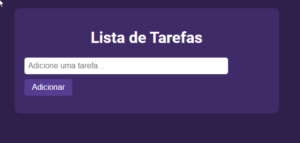
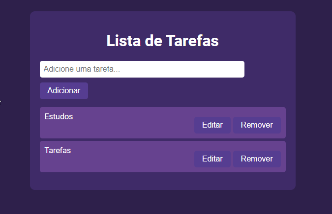

# 🗒️ Lista de Tarefas

## 📖 Descrição
A **Lista de Tarefas** é um aplicativo web simples e eficaz que permite aos usuários gerenciar suas tarefas de forma fácil e intuitiva. Com uma interface amigável, o aplicativo possibilita adicionar, editar e remover tarefas conforme necessário.

## 💻 Tecnologias Utilizadas
- **HTML**: Estruturação do conteúdo e layout do aplicativo.
- **CSS**: Estilização da interface, incluindo responsividade e efeitos visuais.
- **JavaScript**: Lógica para a adição, edição e remoção de tarefas.

## 🛠️ Funcionalidades
- **Adicionar Tarefa**: Permite ao usuário adicionar novas tarefas à lista.
- **Editar Tarefa**: Usuários podem editar tarefas existentes com um prompt simples.
- **Remover Tarefa**: Tarefas podem ser removidas da lista com um clique.

## 📚 Como Usar
1. **Adicione uma Tarefa**: Insira uma tarefa no campo de texto e clique no botão "Adicionar" para incluir na lista.
2. **Edite uma Tarefa**: Clique no botão "Editar" ao lado da tarefa que deseja modificar e insira o novo texto.
3. **Remova uma Tarefa**: Clique no botão "Remover" para excluir a tarefa da lista.

## 🖼️ Imagens do Projeto
### Interface Principal

### Tarefa Adicionada

## 🤝 Como Contribuir
1. Faça um fork deste repositório.
2. Crie uma branch para a sua feature (`git checkout -b minha-nova-feature`).
3. Faça commit das suas alterações (`git commit -am 'Adicionei uma nova feature'`).
4. Faça push para a branch (`git push origin minha-nova-feature`).
5. Abra um pull request.

## 📜 Licença
FREE!

## 📫 Contato
- **Nome**: André
- **GitHub**: [Perfil GitHub](https://github.com/4ndredev21)
